# 마이데이터 기반 360도 자산관리 서비스, 하나360

## 프로젝트 정보
- **실습 과제명**: 하나360
- **수행 기간**: 2023.09.01 - 2023.10.20
- **참가 인원**: 1명
- **담당 업무**: 프로젝트 기획, 디자인, 설계, 구현 및 인프라 구축

## 사용 기술 및 환경
- **개발 환경**
    - OS: Window11, Ubuntu Linux 20.04
    - Framework: SpringBoot 3.1.2, Mybatis 3.0.0
    - Cloud: AWS EC2 Cloud
- **Language/Tool/DB**
    - Language: Java(17), HTML / CSS / JS
    - Tool: Intellij IDEA 2023.2, SQL Developer
    - Database: Oracle Database 19c
    - VCS: Github
## 개발 일정
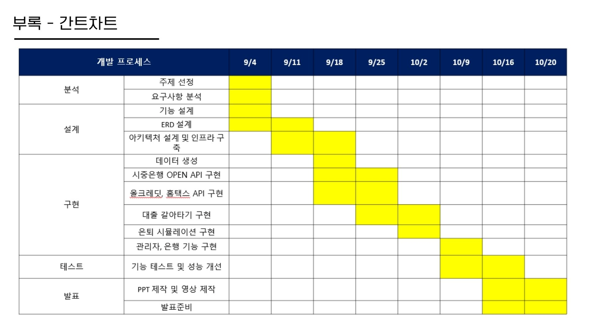
## 특화 기술
### 가상의 OPENAPI 개발
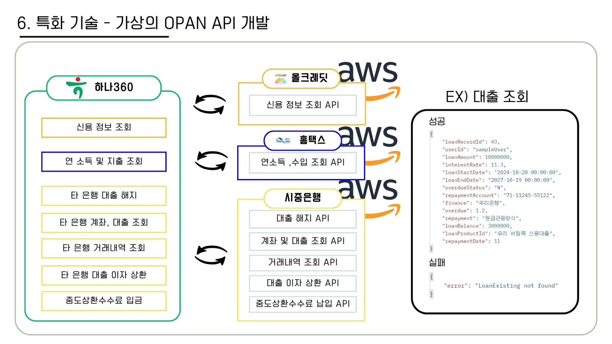
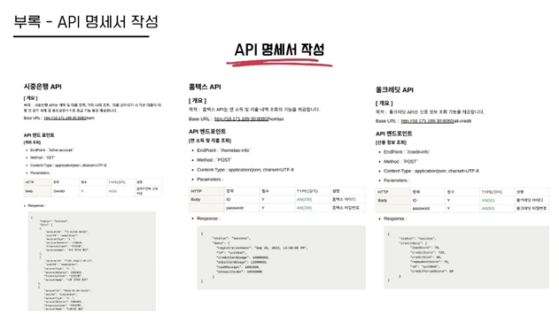
### RSA 암호화 알고리즘
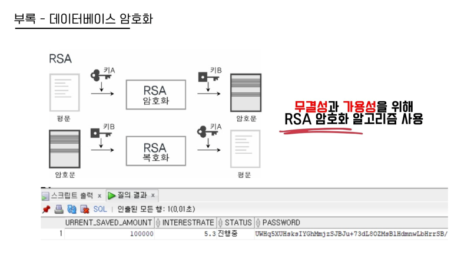
### 디자인 패턴 적용
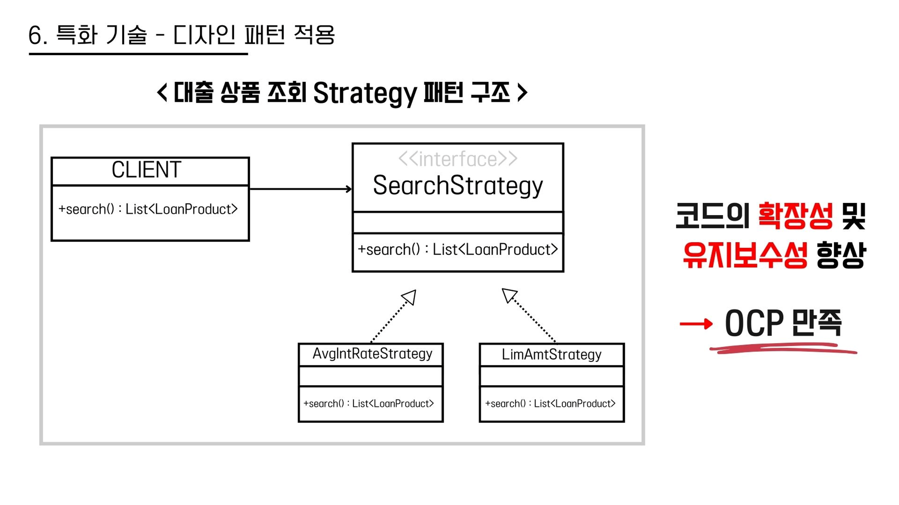
### 그 외에 다양한 기술
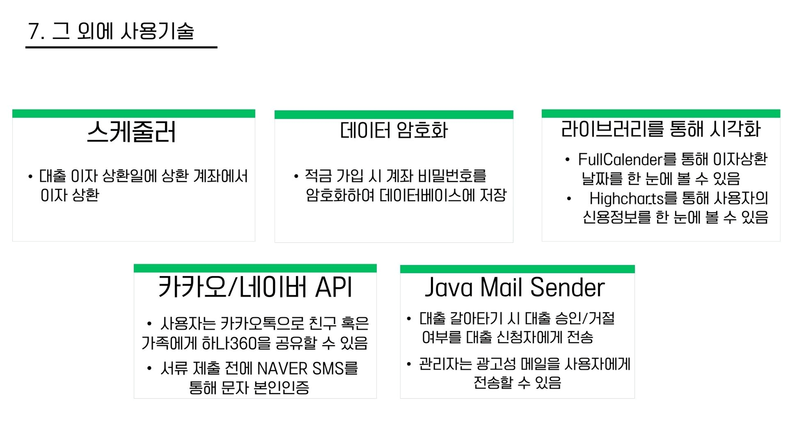
## 개요 및 목적
### 개요
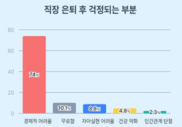

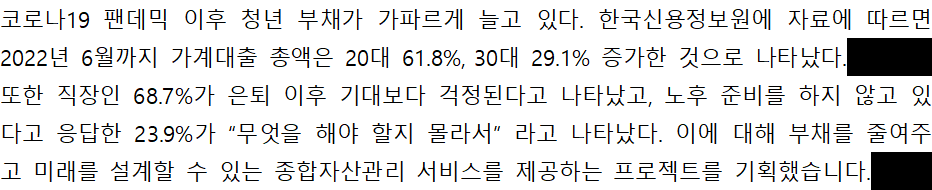
### 목적
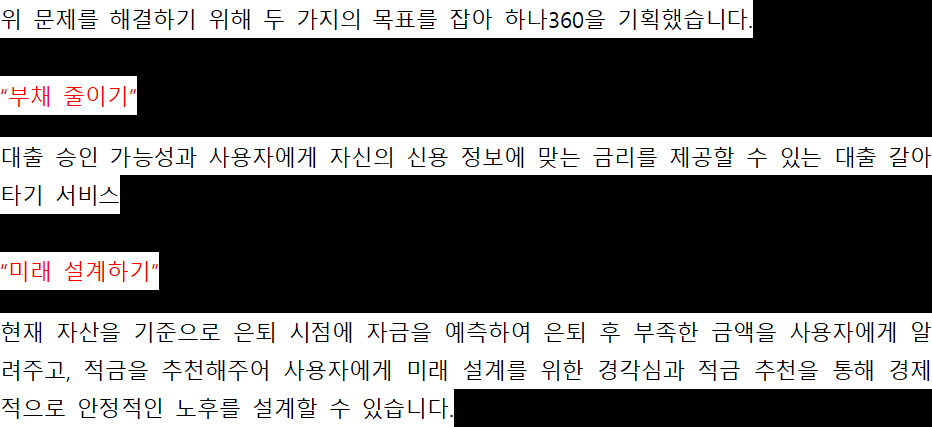
## 주요 기능

### 은행 관련(자행)
- 계좌 조회
- 대출 조회
- 적금 조회
- 거래내역 조회

### 오픈뱅킹 관련(타행)
- 계좌 조회
- 대출 조회
- 거래내역 조회

### 대출 갈아타기
- 신용 기반 대출 추천 (가상의 올크레딧 OPEN API 기반)
- 서류 제출 (가상의 올크레딧, 홈택스 OPEN API 기반)
- 기존 대출 해지 및 새로운 대출 가입 (가상의 시중은행 OPEN API 기반)

### 대출
- 대출 상품 조회 및 대출 심사 현황
- 이자 상환 캘린더를 통해 이자 상환 날짜, 이자 금액 확인 및 스케줄러를 통한 대출 이자 상환
- 현재 대출 상황을 기준으로 대출 상황 평가
- 대출 심사 (은행원)

### 은퇴 시뮬레이션
- 마이데이터 기반 자산 및 부채 불러오기 (가상의 시중은행 API)
- 은퇴 후 생활비 추천 (가상의 홈택스 API)
- 연 소득 및 지출 정보 가져오기
- 현재 자산 및 은퇴 후 생활비 등 입력 정보를 바탕으로 은퇴 후 자금 예측 및 적금 추천 및 가입
- 적금 가입 시 계좌 비밀번호 RSA 암호화 알고리즘
- 은퇴 시뮬레이션을 바탕으로 은퇴 진단 서비스

## 서비스 아키텍처
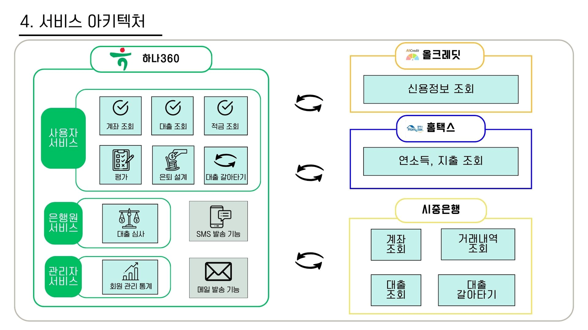

## 시스템 아키텍처
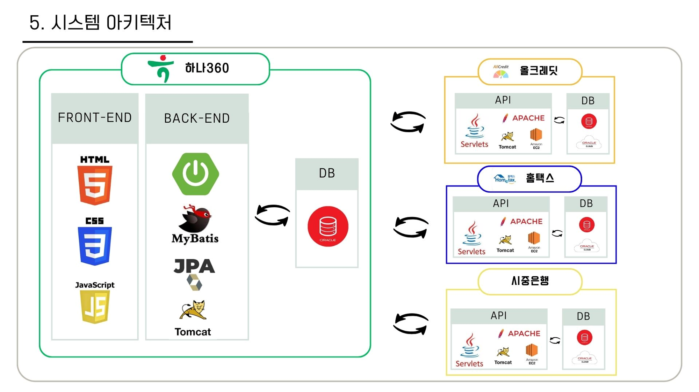

## ERD
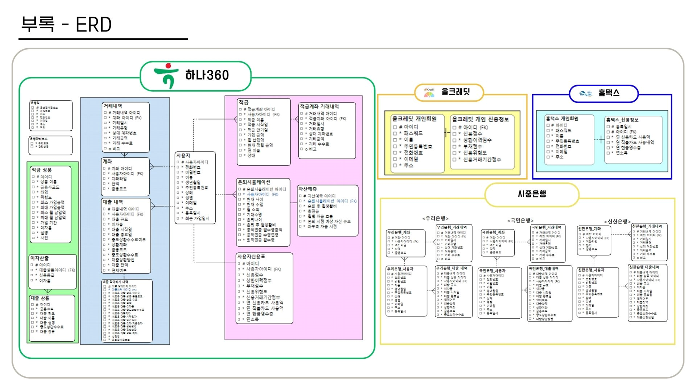
## 기대 효과 및 보완점
### 기대효과
- **사용자 관점**
    1. 부채 관리 개선
    2. 효과적인 재무 계획
- **기업 관점**
    - "종합자산관리" 통한 접근성 향상

### 보완점
- 은퇴 시뮬레이션 고도화
- OPEN API 보안 강화

## 느낀점
- **성장**
    - 프로젝트 기획, 인프라, 개발 등 다양한 업무를 혼자 도맡아 하며 웹 개발자의 역량을 향상하고 스스로 많이 성장하였습니다.

